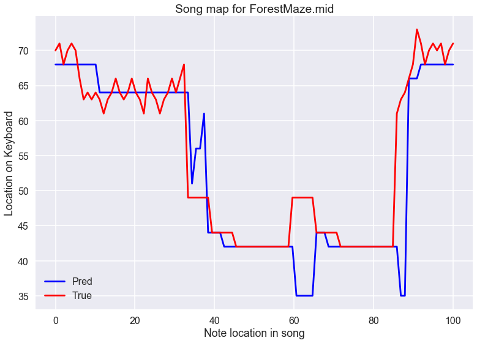

# NNCompose - The Neural Net Composer

**Warning: This project is still in major development and is not intended for
personal use yet.**

The idea behind this is that a MIDI file stores all of the information behind
a song. If one can convert a MIDI file from a binary format, to a
human-readable format, all of the structure of the song (note, timing,
velocity, etc) is open to the world. With this information, and a clever setup
for a neural network to 'learn' about a song, one should be able to generate
new music based on the music used to train the network. A more detailed
write-up about how this accomplished is coming soon. An example of how the
neural net can learn a song is shown below. This maps the first 100 notes in
the song with the actual note in red and the predicted note in blue. This is
during an early training iteration, so it has not yet learned the minute
details and is instead mapping along with the overall structure of the song.

### The Tools

Keras is the main library for building out the neural network and training it.
To convert the MIDI files to a useful format, the program relies on the
"midi2csv" program that works in UNIX environments:
[midicsv](http://www.fourmilab.ch/webtools/midicsv/). The rest is all written
in Python and relies on numpy and pandas for formatting the data and accessing
things as necessary for training and predictions. 

### Example

The most successful iteration of the project so far trained on 6 of Bach's
Cantate's for solo guitar. It also incorporates the ability to play chords and
rests.
It's quite large as I just generated 15+ minutes to see how consistent the
algorithm was - but also could be quite interesting. [MP3 Bach
Example](http://zwmiller.com/projects/Bach_Cantate_BWV20_NNCompose.mp3)
